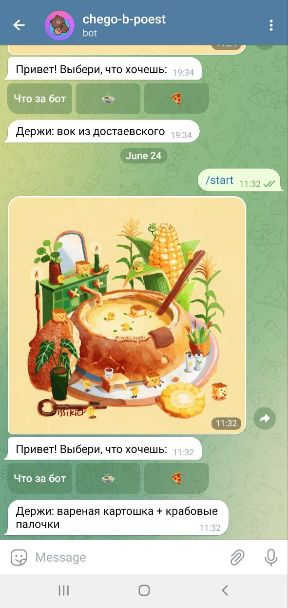

# bot chego-b-poest (чего б поесть)

## Стек
- Node.js
- Telegraf.js

## Описание
Этот Telegram бот разработан для предоставления пользователю рандомного блюда на выбор. Бот имеет две категории: стандартная еда и заказы из ресторанов и кафешек. Пользователь может выбрать категорию и получить случайное блюдо.

## Инструкции по установке и запуску
1. Убедитесь, что у вас установлен Node.js.
2. Склонируйте репозиторий на ваше устройство.
3. В корневой папке проекта выполните команду `npm install`.
4. Создайте файл `config.js` в корневой папке проекта и добавьте в него ваш токен телеграм бота в формате `TOKEN = YOUR_BOT_TOKEN`.
5. Запустите бота, выполните команду `npm start` в корневой папке проекта.
6. Бот будет запущен и готов к использованию.
7. *Опционально можно сделать свои лист/свой лист с блюдами.

## Предпросмотр

